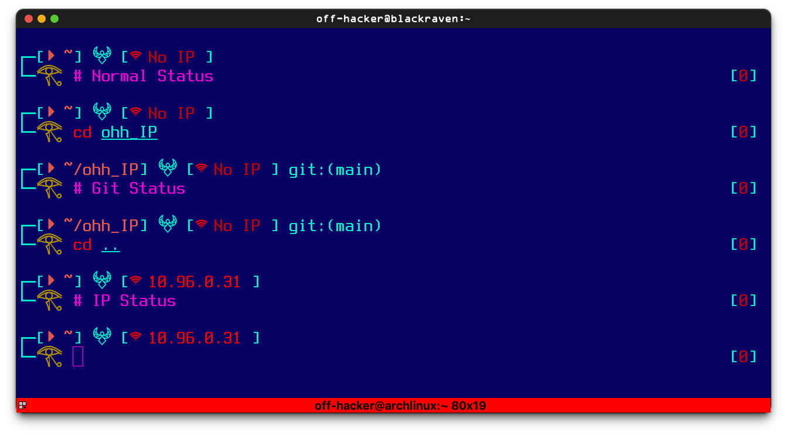

# Ohh_IP - OhMyZsh Theme for CTFs
A Oh-My-Zsh theme for CTFs

## Overview / Screenshot

# Installation
- Copy `ohh_IP.zsh-theme` file into your ~/.oh-my-zsh/themes/` directory.
- Open your `.zshrc` file and change your zsh theme.
